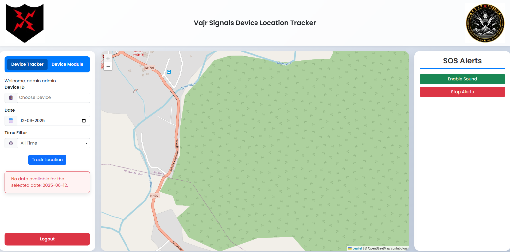
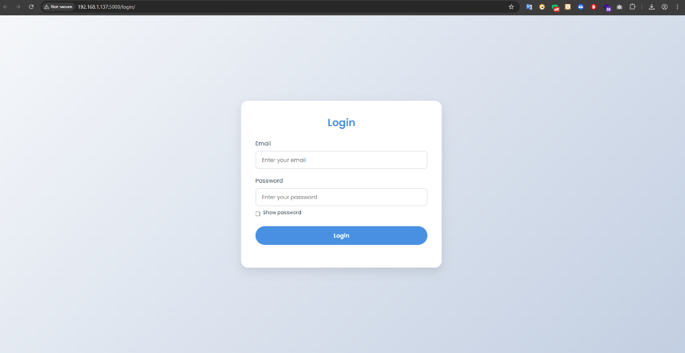
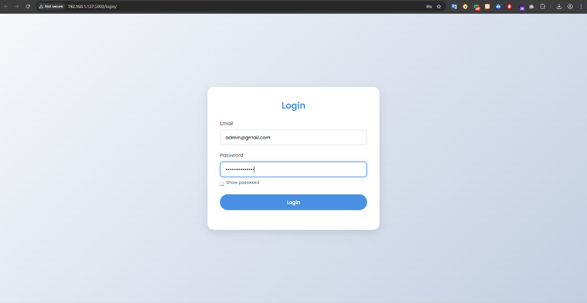
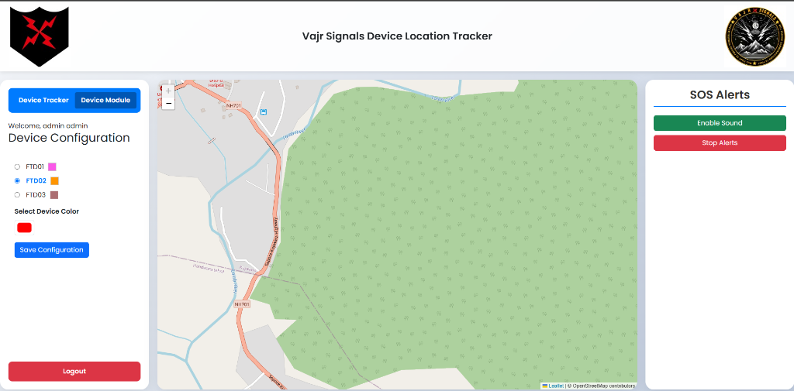
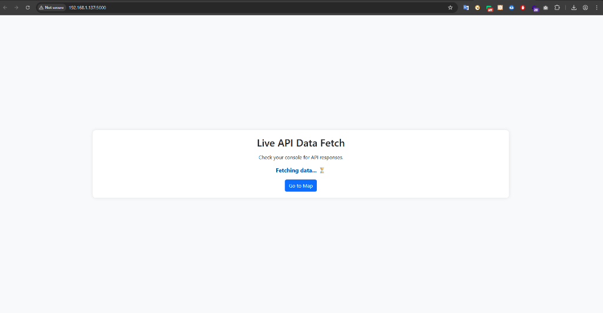

# lorawan_gps_tracking

A full-stack Django application for real-time monitoring of GPS-enabled devices. This system parses device telemetry from TeraTerm logs and visualizes movements on an interactive map.

## � Visual Overview

### Main Dashboard


### User Authentication
| Login (Empty) | Login (Admin) |
| :---: | :---: |
|  |  |

### Device Management & Status
| Device Configuration | API Data Fetching |
| :---: | :---: |
|  |  |

## �🚀 Features

- **Real-time Map Visualization**: Track multiple devices on an interactive map interface.
- **Smart Log Ingestion**: Automatically parses TeraTerm (`.log`) files to sync GPS coordinates with the database.
- **Device Management**:
  - Toggle device visibility (Active/Inactive).
  - Assign custom colors for each device marker.
- **Emergency SOS Alarms**:
  - Real-time SOS packet detection.
  - Visual and audio alerts (SOS siren) on the dashboard.
  - Ability to stop/clear alarms.
- **Custom User Authentication**: Secure email-based login system with personalized settings.
- **Filtering**: View historical paths based on specific dates and custom time intervals (e.g., 2s, 5m).

## 🛠️ Technology Stack

- **Backend**: Python 3.10+, Django 5.1.6, Django REST Framework.
- **Frontend**: HTML5, Vanilla JavaScript, CSS3.
- **Database**: SQLite (default) / MySQL support included.
- **Additional**: Pillow (for user avatars), MySQLClient.

## 📋 Requirements

Ensure you have the following installed:
- Python 3.10+
- Django 5.1.6
- MySQL (Optional, if switching from SQLite)

## ⚙️ Installation

1. **Clone the repository**:
   ```powershell
   git clone <repository-url>
   cd GPS_Tracking
   ```

2. **Set up Virtual Environment**:
   ```powershell
   python -m venv venv
   .\venv\Scripts\activate
   ```

3. **Install Dependencies**:
   ```powershell
   pip install -r requirements.txt
   ```

4. **Database Migrations**:
   ```powershell
   python manage.py makemigrations
   python manage.py migrate
   ```

5. **Create Superuser** (for admin access):
   ```powershell
   python manage.py createsuperuser
   ```

## 🏃 How to Run

### Development Server
Start the server using the default Django command:
```powershell
python manage.py runserver
```

### Production/Network Mode
If you need to access the server over a local network (e.g., for device testing), you can run:
```powershell
python manage.py runserver 0.0.0.0:8000
```
*(Note: Ensure your firewall allows traffic on the specified port.)*

## 🛰️ Log Ingestion (How it Works)

The system integrates with field devices that log their data via TeraTerm.
1. Place your TeraTerm log files in the project root directory.
2. **Naming Convention**: `teraterm_YYMMDD.log` (e.g., `teraterm_250225.log` for Feb 25, 2025).
3. The `LogIngestionService` (found in `services.py`) automatically parses these files for tags like `LAT:`, `LONG:`, `DEV_ID:`, and `PCKT_ID:`.
4. SOS packets (`PCKT_ID: SOS`) automatically trigger emergency alarms in the UI.

## 📂 Project Structure

- `GPS_App/`: Core business logic, models, and API views.
- `GPS_Tracking/`: Django project settings and configuration.
- `templates/`: HTML templates (Map, Index, Login).
- `static/`: Assets including CSS, JS, and the SOS siren audio.
- `requirements.txt`: List of required Python packages.

---
*Created with ❤️ for GPS Monitoring.*
